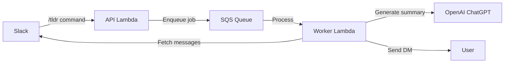

# TLDR — Slack ChatGPT Summarizer

[](https://www.rust-lang.org)
[](https://opensource.org/licenses/MIT)
[](https://aws.amazon.com/lambda/)

TLDR is a serverless, Rust-powered Slack bot that turns a wall of unread messages into a concise, ChatGPT-generated summary delivered straight to your DM.

## 📖 Table of Contents

- [Key Features](#-key-features)
- [High-Level Architecture](#️-high-level-architecture)
- [Usage](#-usage)
- [Quick Start for Local Development](#-quick-start-for-local-development)
- [Deployment (AWS CDK)](#️-deployment-aws-cdk)
- [Configuration](#-configuration)
- [Slack Setup](#-slack-setup)
- [Project Layout](#️-project-layout)
- [Troubleshooting](#-troubleshooting)
- [Contributing](#-contributing)
- [License](#-license)

---

## ✨ Key Features

- **Slash Command Workflow** – Trigger summaries with `/tldr` in any channel.
- **AI-Generated Summaries** – Uses OpenAI ChatGPT to distill unread messages.
- **Two-Lambda Architecture** – Instant slash-command acknowledgement + async processing for snappy UX.
- **Built with Safe, Async Rust** – Tokio runtime, `slack-morphism` and `openai-api-rs`.

---

## 🏗️  High-Level Architecture



1. **API Lambda** – Verifies Slack signatures and enqueues a summarisation job to SQS.
2. **Worker Lambda** – Fetches unread channel messages, asks ChatGPT to summarise them, and DMs the user.

---

## 🚀  Usage

1. **Install the Slack App** in your workspace (see *Slack Setup* below).
2. In any channel type:

```text
/tldr
```

3. A DM will arrive with a neatly formatted summary of everything you missed. ✨

### Advanced Parameters

You can tailor the summary by appending flags / key-value pairs after the command:

| Parameter | Example | Description |
|-----------|---------|-------------|
| `count=<N>` | `/tldr count=50` | Summarise the **last N** messages instead of just unread messages. |
| `channel=<#channel>` | `/tldr channel=#general` | Post the summary to a different channel (defaults to DM). |
| `--visible` / `--public` | `/tldr --visible` | Make the summary visible to everyone in the target channel. |
| `custom="…"` | `/tldr custom="Write at an 8th-grade level"` | Provide a custom prompt (max 800 chars) to influence the writing style. |

Parameters can be combined:

```text
/tldr count=100 channel=#project-updates --visible custom="Use bullet points and include action items"
```

---

## 🔧  Quick Start for Local Development

### Prerequisites

- Rust (stable, Edition 2024)
- `cargo-lambda` ≥ 0.17 for local Lambda builds
- AWS CLI with a profile that can deploy Lambda + SQS
- Node 18+ & npm (only for the CDK infrastructure)
- A Slack workspace & OpenAI API key

### Steps

```bash
# 1. Clone
$ git clone https://github.com/your-org/tldr.git && cd tldr

# 2. Configure environment
$ cp .env.example .env   # then edit the values

# 3. Build & test the Lambda crate
$ cd lambda
$ cargo test
$ cargo lambda build --release

# 4. Spin up a local Lambda for manual testing
$ cargo lambda watch   # default on :9000
```

Invoke the API Lambda locally with a sample payload:

```bash
$ cargo lambda invoke --data-file test/fixtures/slash_command.json
```

---

## ☁️  Deployment (AWS CDK)

The **`infrastructure/`** folder contains an *AWS CDK* stack that provisions:

- API Gateway endpoint
- Two Lambda functions (API + Worker)
- SQS queue
- IAM roles & CloudWatch logs

Deploy in one command:

```bash
$ cd infrastructure
$ npm install             # first time only
$ npm run cdk deploy
```

After the stack is live, copy the API Gateway URL into your Slack slash-command configuration.

---

## 🔌 Slack Setup

To install TLDR in your Slack workspace:

1. **Create a Slack App**:
   - Visit [api.slack.com/apps](https://api.slack.com/apps)
   - Click "Create New App" → "From scratch"
   - Name it "TLDR" and select your workspace

2. **Configure OAuth & Permissions**:
   - Navigate to "OAuth & Permissions"
   - Add these Bot Token Scopes:
     - `channels:history` - Read channel message history
     - `channels:read` - View basic channel info
     - `chat:write` - Send messages as the bot
     - `commands` - Add slash commands
     - `users:read` - View user profiles

3. **Create the Slash Command**:
   - Go to "Slash Commands" → "Create New Command"
   - Command: `/tldr`
   - Request URL: Your API Gateway endpoint (after deployment)
   - Short Description: "Summarize unread messages"
   - Usage Hint: `[count=N] [channel=#name] [--visible] [custom="prompt"]`

4. **Install to Workspace**:
   - Go to "Install App" and click "Install to Workspace"
   - Copy the Bot User OAuth Token (starts with `xoxb-`)
   - Save it as `SLACK_BOT_TOKEN` in your environment

5. **Get Signing Secret**:
   - From "Basic Information", copy the Signing Secret
   - Save it as `SLACK_SIGNING_SECRET` in your environment

---

## 🔐  Configuration

Environment variables (set in Lambda or an `.env` file for local runs):

| Variable | Purpose |
|----------|---------|
| `SLACK_BOT_TOKEN` | Bot OAuth token (starts with `xoxb-…`) |
| `SLACK_SIGNING_SECRET` | Verifies Slack requests |
| `OPENAI_API_KEY` | Access token for ChatGPT |
| `PROCESSING_QUEUE_URL` | URL of the SQS queue |

---

## 🗂️  Project Layout

```
├─ lambda/          # Rust crate with both Lambda handlers
│   ├─ src/
│   │   ├─ api.rs
│   │   ├─ worker.rs
│   │   └─ bot.rs  # SlackBot implementation (shared)
│   └─ Cargo.toml
├─ infrastructure/  # AWS CDK stack (TypeScript)
├─ tests/           # Integration & fixture payloads
└─ README.md
```

---

## 🤝  Contributing

1. Make sure `cargo check` and `cargo clippy -- -D warnings` pass.
2. Add unit tests in `#[cfg(test)]` modules and doc-tests in public APIs.
3. Open a PR – GitHub Actions will run the full test & lint suite.

---

## 🔧 Troubleshooting

### Common Issues

**"Command not found" error in Slack**
- Ensure the app is installed in your workspace
- Check that the slash command is properly configured
- Verify the Request URL points to your deployed API Gateway endpoint

**Bot doesn't respond or times out**
- Check CloudWatch logs for both Lambda functions
- Verify all environment variables are set correctly
- Ensure the SQS queue exists and Lambda has permissions to read from it

**"Missing permissions" errors**
- The bot needs to be invited to private channels: `/invite @tldr`
- Verify all required OAuth scopes are added (see Slack Setup)
- Reinstall the app if you've changed permissions

**Summary quality issues**
- Try adjusting the `custom` parameter with specific instructions
- Ensure your OpenAI API key has sufficient credits
- Check if the channel has enough message history

**Lambda deployment failures**
- Ensure `cargo-lambda` is installed and up to date
- Check that your AWS credentials have the necessary permissions
- Verify the Rust toolchain is set to stable

---

## 📄  License

MIT © 2025 TLDR Contributors
